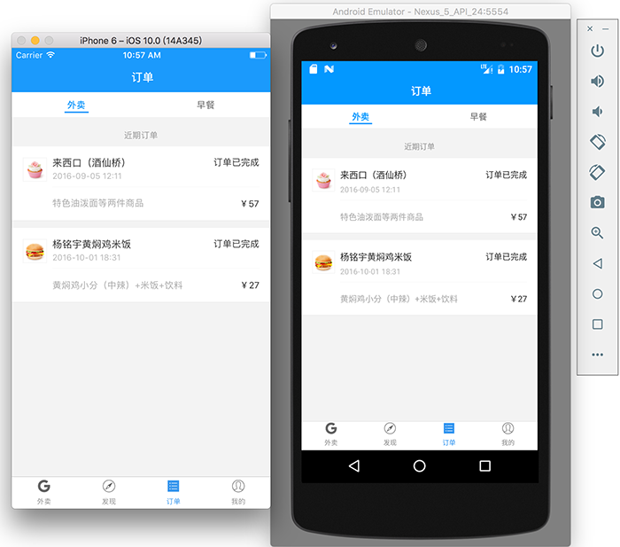
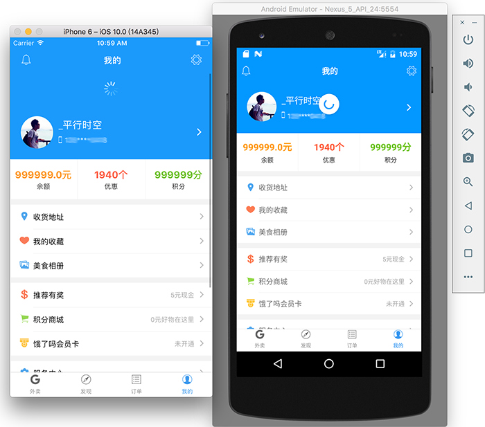

# elm-react-native


[](https://facebook.github.io/react-native)
[](https://github.com/stoneWeb/elm-react-native)
[](https://github.com/attentiveness/reading/pulls)
[](http://opensource.org/licenses/MIT)

This is a high simulating eleme app [**(eleme website)**](https://www.ele.me/), implemented by [**React Native**](http://facebook.github.io/react-native/). This app can run on iOS and Android, the app has no use to any API, no data, it is a UI display App, the UI of the app has more than 95% in common with eleme app. This is a learning React Native process, it is a demo project.

Welcome issues, PR, star.

## App uses these dependencies
- [react-native-blur](https://github.com/react-native-fellowship/react-native-blur)
- [react-native-swiper](https://github.com/leecade/react-native-swiper)
- [react-native-parabolic](https://github.com/stoneWeb/react-native-parabolic)
- [react-native-vector-icons](https://github.com/oblador/react-native-vector-icons)
- [react-native-tab-navigator](https://github.com/exponent/react-native-tab-navigator)
- [react-native-splash-screen](https://github.com/crazycodeboy/react-native-splash-screen)
- [react-native-scrollable-tab-view](https://github.com/skv-headless/react-native-scrollable-tab-view)

## Run app
First of all need to install run React Native related to the environment. Please use Android studio to open android folder, if you want to run in android simulator.
```
git clone https://github.com/stoneWeb/elm-react-native.git
cd elm-react-native && npm install
react-native link
react-native run-ios
```


## Screenshot






## License

[**The MIT License**](http://opensource.org/licenses/MIT).
