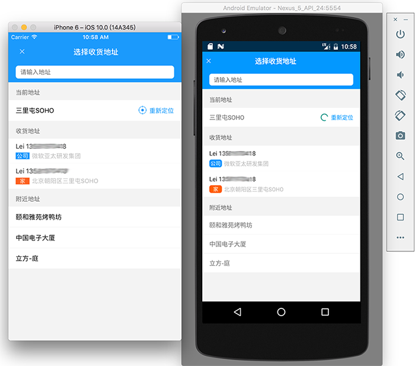

# elm-react-native
A react native app simulating eleme app，run ios and android.

## App uses these dependencies
- [react-native-blur](https://github.com/react-native-fellowship/react-native-blur)
- [react-native-swiper](https://github.com/leecade/react-native-swiper)
- [react-native-vector-icons](https://github.com/oblador/react-native-vector-icons)
- [react-native-tab-navigator](https://github.com/exponent/react-native-tab-navigator)
- [react-native-splash-screen](https://github.com/crazycodeboy/react-native-splash-screen)
- [react-native-scrollable-tab-view](https://github.com/skv-headless/react-native-scrollable-tab-view)

## Run app
```
git clone https://github.com/stoneWeb/elm-react-native.git
cd elm-react-native && npm install
react-native link
react-native run-android / run-ios
```
## Screenshot





